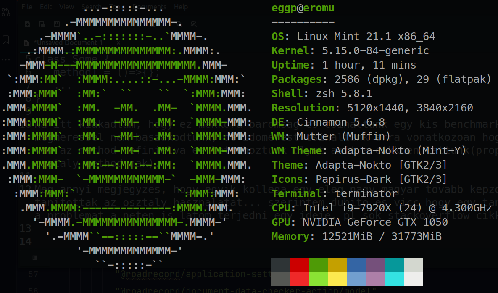

#### Test machine:

Start benchmark, iteration per test 1000000

## Result:

### node 16

- NormalEgg1 => 117.56320833337183 ms
- NormalEgg2 => 122.89447066669042 ms
- NormalEgg3 => 122.44642033319299 ms
- NormalEgg4 => 122.80945899989456 ms
- MisunderstoodEgg1 => 288.5027913333227 ms
- MisunderstoodEgg2 => 398.02862966666 ms
- MisunderstoodEgg3 => 553.8344616667988 ms
- MisunderstoodEgg4 => 769.8537286664359 ms

### node 18

- NormalEgg1 => 121.13038766679044 ms
- NormalEgg2 => 122.23305800013866 ms
- NormalEgg3 => 121.70180666648473 ms
- NormalEgg4 => 119.64383700008814 ms
- MisunderstoodEgg1 => 207.0737946666777 ms
- MisunderstoodEgg2 => 225.7451426667782 ms
- MisunderstoodEgg3 => 286.12517200022313 ms
- MisunderstoodEgg4 => 372.05425966670737 ms

### browser(chrome 117.0.5938.92):

- NormalEgg1 => 89.56666666672875 ms
- NormalEgg2 => 103.53333333320916 ms
- NormalEgg3 => 102.5333333335196 ms
- NormalEgg4 => 106.36666666654249 ms
- MisunderstoodEgg1 => 136.03333333336437 ms
- MisunderstoodEgg2 => 187.70000000003105 ms
- MisunderstoodEgg3 => 135.1333333334575 ms
- MisunderstoodEgg4 => 224.53333333336437 ms
